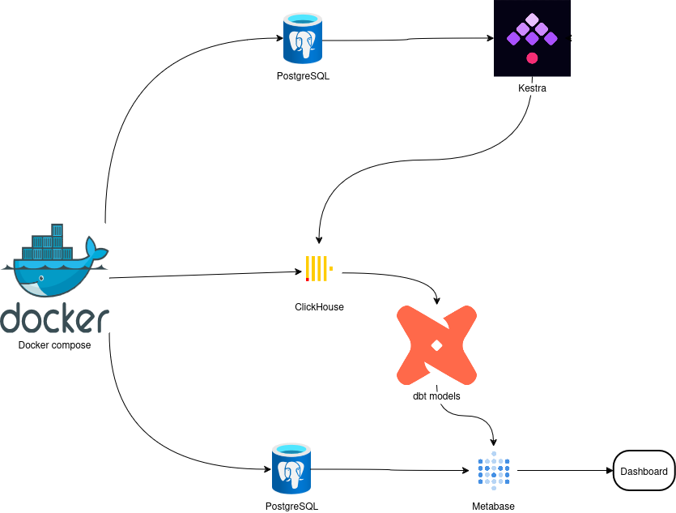
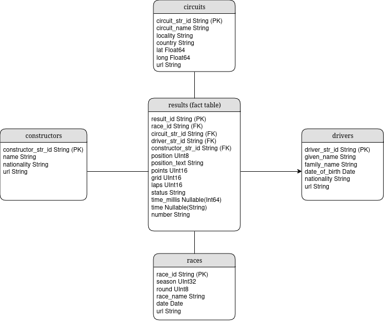
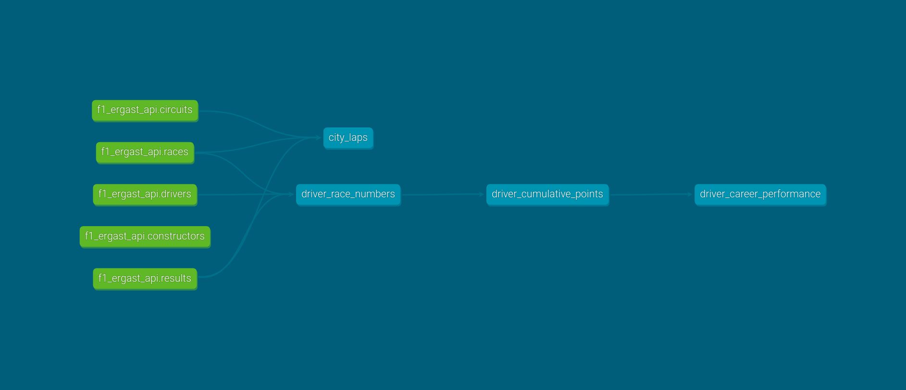

# Formula 1 Data Analysis Project

## Overview

This project is designed to analyze Formula 1 data using various tools and technologies. The project includes data ingestion, processing, and analysis of races data from the ergast.com API. The main components of the project are:

- **SQL Script**: To structure the clickhouse database.
- **dbt Models**: To transform the raw data into tables used for analysis
- **Kestra and its flows**: To orchestrate the data workflows and automate tasks. They include several steps for data ingestion and storage with mainly Python scripts.
- **Metabase**: To visualize the data and create dashboards for analysis.
- **Docker and Docker Compose**: To containerize the project and simplify deployment.

They interoperate as follows:
- Kestra retrieves the data from the API respecting its limits and introduces it into a ClickHouse database.
- dbt Models transform the raw data into tables used for analysis within the ClickHouse database.
- Metabase is used for data visualization and dashboard creation

## Project Structure

- `clickhouse`: Contains the SQL script for creating the basic ClickHouse database schema.
- `dbt`: Contains the dbt project with models for transforming the raw data into tables used for analysis.
- `kestra-flows`: Contains the flow that ingests and stores normalized data.
- `metabase`: Contains the Metabase backup and restore of dashboards and questions, and also the .jar file for ClickHouse connection.

## Project architecture




## Database Schema (fact and dimension tables)



### dbt lineage



## Prerequisites

- Python and pip
- dbt (installed via pip, preferably in a virtual environment)
- Docker and Docker Compose

## Setup

1. **Clone the repository**:
    ```sh
    git clone git@gitlab.com:exalt-it-dojo/candidats/pablo-calvo-flight-radar-c9ea6ea7-ed6a-4ee2-9e62-905ae0c43e4b.git
    cd pablo-calvo-flight-radar-c9ea6ea7-ed6a-4ee2-9e62-905ae0c43e4b
    ```

2. **Create a virtual environment** (optional):
    ```sh
    python -m venv .venv
    source .venv/bin/activate
    ```

3. **Install dependencies** (optional):
    ```sh
    pip install -r requirements.txt
    ```

## Usage

### Running with Docker Compose

1. **Start the services**:
    ```sh
    docker-compose up --build -d
    ```
   When the setup has ended, the following services should be running:
    - PostgreSQL database for metabase data.
    - ClickHouse database for storing the normalized and analytics data.
    - Metabase service for data visualization.
    - Postgres database for Kestra.
   
2. **Access the Kestra web interface**:
    - Open the Kestra web interface at `http://localhost:8080`.
    - Go to the Flows section and start the `f1-data.ergast_api_call` flow.

3. **Run metabase restore dump**:
    - Run the following command to create a backup of the metabase database:
    ```sh
    ./metabase/restore_metabase.sh
    ```
    - You can backup the information again by running
    ```sh
    ./metabase/backup_metabase.sh
    ```
    - The backup will be stored in the `metabase/` directory.
    - If the file doesn't run, you might have to make it executable by running:
    ```sh
    sudo chmod +x metabase/restore_metabase.sh
    ```

4. **Run dbt models**:
    - Go to the folder `dbt/f1_ergast_api` with the terminal.
   ```sh
    cd dbt/f1_ergast_api
    ```
    - Run the following command to run the dbt models:
    ```sh
    dbt run
    ```
    - You can also test the models by running:
    ```sh
    dbt test
    ```

5. **Access the Metabase web interface**:
    - Open the Metabase web interface at `http://localhost:3000`.
    - Log the credentials I have provided you in my email.
    - You could go to Admin, Databases, and sync the ClickHouse database so the dashboards contain the appropriate data.
    - You can check the dashboard I have created for you. `http://localhost:3000/dashboard/1-f1-data`


### Next steps

1. **Simplifying Kestra flows**:
    - The flows could be refactored to make them more modular and easier to maintain, especially the Python scripts.
    - The flows could be optimized for performance by reducing unnecessary steps and improving data processing efficiency.

2. **Adding Kestra flow with triggers to load new dbt models**:
   - A new flow could be created to trigger the dbt models after the data ingestion flow has completed.

3. **Adding more dbt models**:
    - More dbt models could be added to transform the raw data into additional tables for analysis.
    - The existing models could be optimized for performance and efficiency.
4. **Improvement of sensitive variables handling**:
    - The sensitive variables are currently hardcoded in the Kestra flows and dbt profiles. It would be better to use environment variables or a secrets management tool to store and retrieve these variables securely, in a production environment.
   
5. **CI/CD Pipeline**:
   - Set up a CI/CD pipeline using Jenkins, GitLab CI/CD, or GitHub Actions.
   - The pipeline should include steps for linting, testing, building, and deploying the project.
   - The pipeline should be triggered on every push to the main branch.
   - More reduced, focused pipelines could be created for development branches.
   - The pipeline should include steps for deploying the project to the production environment, or you could do that locally with Terraform.

6. **Comprehensive testing**:
   - Implement unit tests, integration tests, and more thorough data tests for the project.

7. **Security**:
   - Implement security best practices for the project, including encryption, access control, and data protection.
   - Use secrets management tools like HashiCorp Vault or AWS Secrets Manager to store sensitive information.
   - Implement role-based access control (RBAC) for Kestra and Metabase.

8. **Monitoring and Alerting**:
   - Set up monitoring and alerting for the project using tools like Prometheus, Grafana, and ELK Stack.
   - Monitor key metrics such as data ingestion rate, latency, and error rates.
   - Set up alerts for critical issues such as data pipeline failures or database outages.

## Project Choices and Explanations

### ClickHouse instead of Neon Postgres
Because of being more familiar with ClickHouse than Neon, I decided to go with ClickHouse since it provided also good performance for analytical queries since it is an OLAP database.
### Metabase instead of Rill
I chose Metabase because it is more user-friendly and easier to set up than Rill, especially considering that I didn't know Rill beforehand. It also provides a sufficient range of visualization options and dashboards that can be easily shared with other users.

## Contact

For any questions or feedback, feel free to reach out to me at [pablomc87@gmail.com](mailto:pablomc87@gmail.com)
